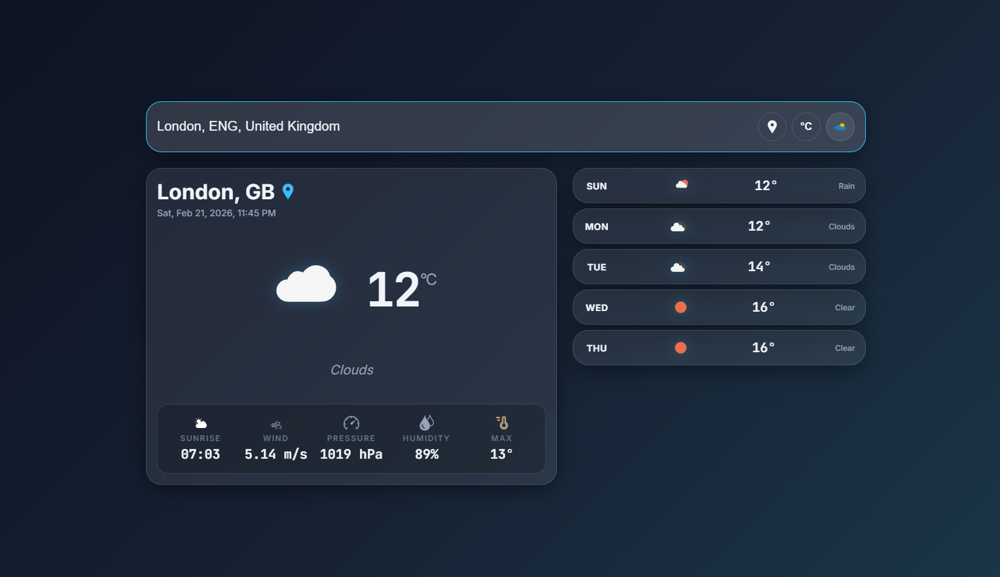

#  Weather App (React)

A simple and responsive Weather App built with **React** that allows users to search for real-time weather information for any city using a public weather API.

##  Features

* Search weather by city name
* Display current temperature, humidity, wind speed, and weather condition
* Responsive UI (mobile & desktop friendly)
* Error handling for invalid city names
* Clean and modern design
* Built with React functional components & hooks

##  Tech Stack

* **Frontend:** React, HTML, CSS, JavaScript, scss
* **API:** OpenWeatherMap API (or any weather API)
* **Build Tool:** Vite or Create React App

##  Installation

1. Clone the repository:

```bash
git clone https://github.com/zaidbouallala-alb/weather-app-react.git
```

2. Navigate to the project folder:

```bash
cd weather-app-react
```

3. Install dependencies:

```bash
npm install
```

4. Start the development server:

```bash
npm run dev
# or
npm start
```

##  API Setup

1. Create a free account on OpenWeatherMap: [https://openweathermap.org/](https://openweathermap.org/)
2. Get your API key
3. Create a `.env` file in the root directory and add:

```env
VITE_WEATHER_API_KEY=YOUR_API_KEY
```

> If you're using Create React App:

```env
REACT_APP_WEATHER_API_KEY=YOUR_API_KEY
```

4. In your React code:

```js
const apiKey = import.meta.env.VITE_WEATHER_API_KEY;
// or
const apiKey = process.env.REACT_APP_WEATHER_API_KEY;
```

##  Project Structure

```
weather-app-react/
├── src/
│   ├── components/
│   ├── pages/
│   ├── services/
│   ├── App.jsx
│   └── main.jsx
├── public/
├── .env
├── package.json
└── vite.config.js
```

##  Example Usage

1. Enter a city name (e.g., `Paris`)
2. Click **Search**
3. View real-time weather data

##  Error Handling

* Displays a message if the city is not found
* Handles empty input
* Handles API connection errors

##  Screenshots


*App showing real-time weather data for a city search*

##  Getting Started

### Prerequisites
- Node.js (v14 or higher)
- npm or yarn package manager

### Quick Setup
```bash
# 1. Clone repo
git clone https://github.com/zaidbouallala-alb/weather-app-react.git

# 2. Install dependencies
cd weather-app-react
npm install

# 3. Setup API key
# Create .env file and add your OpenWeatherMap API key

# 4. Run development server
npm run dev
```

